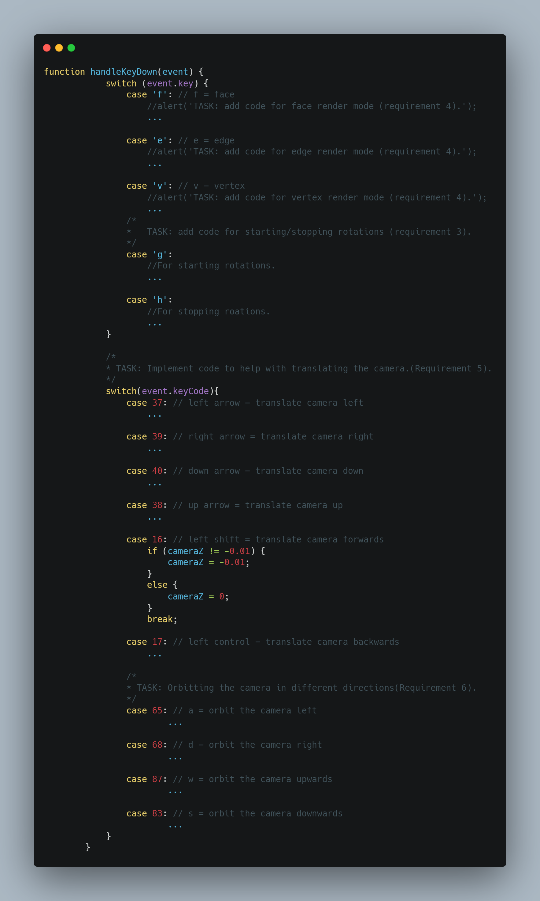

# WebGL Coursework


_Learning about 3D models using WebGL_

**Description:** The project demonstrates the various fundamentals of 3D modelling.
The user is allowed to use a few functionalities, thus providing an interactive experience.
## Installation
After going to the project directory the user may start a python server using the command line:
```
python -m http.server
```
It will tell the user on which port the server is listening to (by default:8000).
In your web browser, go to “http://localhost:PORT”, where “PORT” is the number reported earlier.

You may boot up the HTML file directly but the texture loading and the object loader will not work.

## Usage

        
